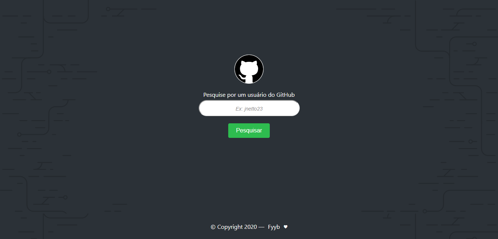
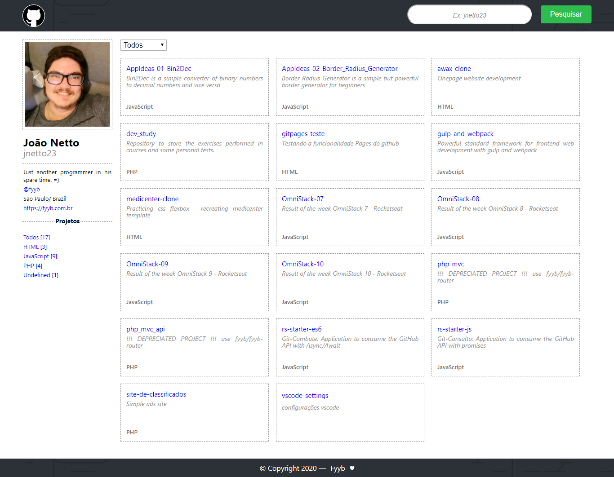

# Git-Consulta

<table>
  <tr>
    <td>
      
    </td>
    <td>
      
    </td>
  </tr>
</table>

## Objective/Challenge 
The challenge of the project was to find the best way to render the information on screen without using javascript synchronous (async / await).  
Solution: use PROMISES. 

**[Final Project](https://jnetto23.github.io/rs-starter-js/index.html)**
